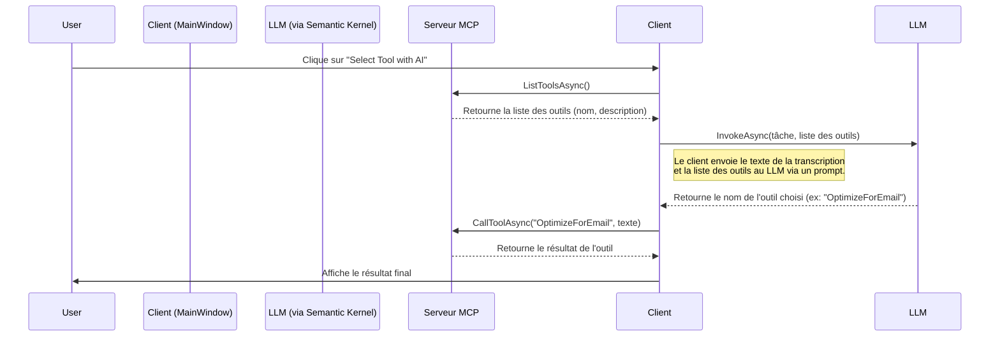

# McpExplorer : Exploration du Model Context Protocol avec .NET

Ce projet est une application d'exploration conçue pour apprendre et démontrer les concepts fondamentaux du **Model Context Protocol (MCP)** en utilisant un écosystème .NET moderne. L'application, construite en WPF, met en œuvre un serveur MCP in-process et un client intelligent capable d'orchestrer dynamiquement des outils.

## Mission du Projet

L'objectif principal de ce projet est éducatif :
1.  **Comprendre le MCP** : Mettre en pratique les concepts de base du protocole, tels que la découverte et l'appel d'outils.
2.  **Explorer l'Orchestration d'IA** : Démontrer comment un client peut sélectionner dynamiquement des outils, que ce soit par des règles logiques simples ou en faisant appel à un Grand Modèle de Langage (LLM).
3.  **Utiliser des Outils .NET Modernes** : Intégrer des bibliothèques de pointe comme le SDK C# officiel du MCP, Semantic Kernel pour l'orchestration IA, et Prompty pour la gestion des prompts.

## Fonctionnalités

L'application WPF fournit une interface simple pour interagir avec un serveur MCP qui expose plusieurs outils :
*   **Transcription Audio (Simulation)** : Un outil qui simule la transcription d'un fichier audio.
*   **Optimisation de Texte** : Deux outils distincts pour reformater un texte pour un courriel professionnel ou un message Microsoft Teams.
*   **Orchestration Côté Client** :
    *   **Basée sur des Règles** : Un bouton qui analyse le contenu du texte pour choisir entre l'optimisation pour courriel ou pour Teams.
    *   **Basée sur l'IA** : Un bouton qui utilise un LLM (via Semantic Kernel) pour analyser la liste des outils disponibles et la tâche de l'utilisateur afin de sélectionner l'outil le plus approprié.

## Architecture et Choix Technologiques

La solution est construite autour de plusieurs composants clés qui interagissent pour créer une application flexible et puissante.

```mermaid
graph TD
    subgraph "Application WPF (McpExplorer.Wpf)"
        direction LR
        A[MainWindow.xaml] -- Interagit avec --> B(MainWindow.xaml.cs);
        B -- Appelle --> C{Client MCP};
        C -- Communique via Stdio --> D{Serveur MCP};
        B -- Utilise --> E[Semantic Kernel];
        E -- Lit --> F(appsettings.json);
        E -- Invoque --> G[LLM (OpenAI, etc.)];
        G -- Décide --> B;
    end

    subgraph "Serveur In-Process (Géré par IHost)"
        direction LR
        D -- Expose --> H(McpExplorerTools.cs);
        H -- Lit --> I(Prompts/.prompty);
    end

    style A fill:#cde4ff
    style F fill:#fff2cd
    style I fill:#fff2cd
    style G fill:#d4edda
```

### 1. **Application WPF avec Serveur In-Process**
L'application est une solution WPF .NET. Plutôt que de dépendre d'un serveur externe, nous utilisons `Microsoft.Extensions.Hosting` pour démarrer et gérer un serveur MCP directement au sein du processus de l'application.
*   **Avantage** : Simplifie grandement le déploiement et le débogage. Le cycle de vie du serveur est lié à celui de l'application.
*   **Implémentation** : Le fichier `App.xaml.cs` configure et lance un `IHost` au démarrage.

### 2. **SDK C# pour le Model Context Protocol**
Nous utilisons la bibliothèque `ModelContextProtocol`, le SDK C# officiel.
*   **Serveur** : `WithToolsFromAssembly()` permet de découvrir et d'exposer automatiquement les méthodes marquées avec les attributs `[McpServerToolType]` et `[McpServerTool]`.
*   **Client** : Le client se connecte au serveur via un transport `Stdio` (Standard Input/Output), parfait pour la communication in-process.

### 3. **Semantic Kernel comme Orchestrateur IA**
Pour la fonctionnalité de sélection d'outil par l'IA, nous utilisons **Microsoft Semantic Kernel**.
*   **Rôle** : Il agit comme un cerveau qui peut raisonner sur les outils disponibles.
*   **Flexibilité** : Il est conçu pour être agnostique au modèle. Nous l'avons configuré pour qu'il puisse utiliser plusieurs fournisseurs de LLM.

### 4. **Configuration Flexible des LLM**
La sélection du fournisseur de LLM (OpenAI, Azure OpenAI, etc.) et des modèles est gérée de manière externe dans un fichier `appsettings.json`.
*   **Avantage** : Permet de changer de LLM sans recompiler l'application.
*   **Implémentation** : Le fichier `appsettings.json` est chargé au démarrage et injecté via l'injection de dépendances dans `MainWindow`.

### 5. **Prompty pour la Gestion des Prompts**
Les prompts, qu'ils soient simples (pour les outils d'optimisation) ou complexes (pour la sélection d'outils par l'IA), sont stockés dans des fichiers `.prompty`.
*   **Avantage** : Sépare la logique du prompt du code C#, ce qui les rend plus faciles à gérer, à versionner et à améliorer.

## Comment ça Marche ? Le Flux de Sélection par IA

Le cœur de la fonctionnalité avancée de ce projet est le bouton "Select Tool with AI". Voici le déroulement de cette action :



1.  **Découverte** : Le client demande au serveur MCP la liste de tous les outils qu'il expose.
2.  **Raisonnement** : Le client envoie cette liste, ainsi que la tâche de l'utilisateur (le texte transcrit), à un LLM via un prompt structuré (`MCPToolSelection.prompty`). Le prompt demande au LLM de choisir l'outil le plus approprié.
3.  **Décision** : Le LLM analyse les descriptions des outils et la tâche, puis retourne sa décision sous forme de JSON.
4.  **Exécution** : Le client utilise le nom de l'outil retourné par le LLM pour effectuer un appel `CallToolAsync` au serveur MCP.

Ce flux démontre parfaitement la puissance du MCP : le serveur expose des capacités, et le client décide intelligemment comment les utiliser.

## Comment Lancer le Projet

### Prérequis
*   SDK .NET 8 ou supérieur.

### Configuration
1.  Ouvrez le fichier `McpExplorer.Wpf/appsettings.json`.
2.  Choisissez un `Provider` (par exemple, "OpenAI").
3.  Remplissez les informations requises pour ce fournisseur (par exemple, `ApiKey` et `Model`).

### Exécution
Ouvrez un terminal à la racine du projet et exécutez la commande suivante :
```bash
dotnet run --project McpExplorer.Wpf/McpExplorer.Wpf.csproj
